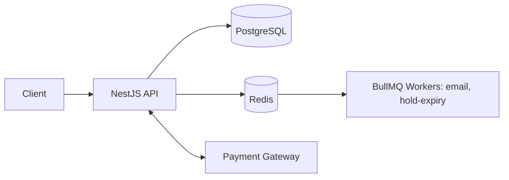
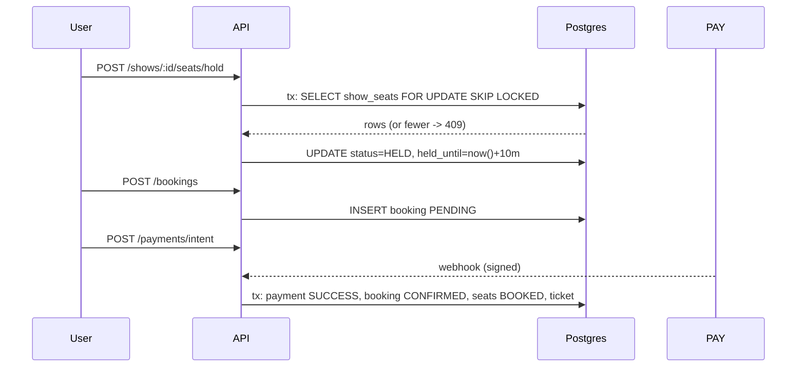

# Architecture

## Scale Assumptions (design target)
- 100k DAU, ~50 RPS peak, 5k bookings/day, hot-show burst ~500 concurrent seat requests.
- Not designing for 500M DAU. Revisit only if load tests prove a bottleneck.

## HLD


## LLD — Booking flow


## State machines
- Seat: AVAILABLE → HELD → BOOKED; HELD → AVAILABLE (expiry); BOOKED → AVAILABLE (cancel)
- Booking: PENDING → CONFIRMED → CANCELLED; PENDING → EXPIRED | FAILED

## Scale Path (only when needed)
| Trigger | Step |
|---|---|
| Read latency high | Redis cache for catalog |
| DB CPU high | Read replica for catalog/search |
| API CPU high | More app instances (stateless) |
| Queue backlog | Separate worker process |
| Hot-show lock contention | Shorter transactions; consider Redis pre-lock |

## Style
Modular monolith (NestJS). One deployable, clear module boundaries.

## Layers
Controller → Service → Repository (TypeORM) → PostgreSQL
Async: Service → BullMQ (Redis) → Processor (email, hold expiry, cleanup)

## Modules
| Module | Responsibility |
|---|---|
| auth | register/login, JWT, refresh rotation |
| users | profile |
| cities, movies, theatres | catalog (theatres include screens + seats) |
| shows | show schedule, pricing |
| seats | seat availability, hold/release |
| bookings | booking lifecycle |
| payments | gateway integration, webhooks, refunds |
| tickets | reference + QR payload |
| notifications | email via BullMQ |
| admin | admin-only endpoints (reuses services) |

## Folder Rules
`common/` = cross-cutting (guards, filters, pipes, decorators). `config/` = typed config. `database/` = data source, migrations, seeds.

## Booking Flow (seat locking)
```
POST /shows/:id/seats/hold
  tx: SELECT show_seats WHERE id IN (...) FOR UPDATE SKIP LOCKED
      if count mismatch or status != AVAILABLE -> 409
      UPDATE status=HELD, held_by=user, held_until=now()+10m
POST /bookings           (seats held by user) -> booking PENDING, amount computed
POST /payments/intent    -> gateway order
POST /payments/webhook   (signed, idempotent)
      tx: payment SUCCESS, booking CONFIRMED, show_seats BOOKED, ticket created
      enqueue email
Expiry: BullMQ repeatable job (every 1 min) releases HELD seats where held_until < now(),
        marks PENDING bookings EXPIRED.
```
Seat state: `AVAILABLE → HELD → BOOKED`, `HELD → AVAILABLE` (expiry/release), `BOOKED → AVAILABLE` (cancellation).
Postgres is the source of truth; see `adr/0001-seat-locking-strategy.md`.

## Booking State Machine
`PENDING → CONFIRMED → CANCELLED` ; `PENDING → EXPIRED | FAILED`

## Cross-Cutting
- Global: ValidationPipe, exception filter, response interceptor, throttler, Helmet.
- Logging: Nest Logger with request id.
- Config: validated env (`env.validation.ts`).
- Caching (optional): Redis for catalog reads (movies, theatres); never for seat state.

## Diagram
```
Client → NestJS API ──► PostgreSQL
              │
              └──► Redis ──► BullMQ workers (email, expiry)
              └──► Payment Gateway (webhook back to API)
```
